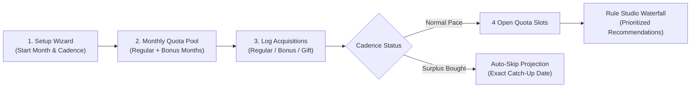

<div align="center">

# Canelé 🍮
### *Deterministic Book Collection Manager & Acquisition Planner*

[-3DDC84?style=flat&logo=android&logoColor=white)](https://www.android.com)
[](https://flutter.dev)
[](https://pub.dev/packages/hive)
[](#-deterministic-quota-engine)
[](LICENSE)

<p align="center">
  <b>Canelé</b> is an elegant, local-first Android app designed for passionate book, manga, comic, and light novel collectors. It replaces opaque, black-box recommendation algorithms with an auditable mathematical quota cadence system and a customizable multi-pass acquisition waterfall.
</p>

[Key Features](#-key-features) •
[Screenshots](#-screenshots) •
[Installation](#-installation--getting-started) •
[How It Works](#-how-it-works) •
[Data Portability](#-data-portability--privacy) •
[Technical Architecture](TECHNICAL.md) •
[Changelog](CHANGELOG.md)

</div>

---

<div align="center">

| Dashboard & Quota Balance | Series Detail & Bulk Mark | Rule Studio & Cadence |
| :---: | :---: | :---: |
|  |  |  |

| Statistics & Insights | Universal File Importer | Setup Wizard & Onboarding |
| :---: | :---: | :---: |
|  |  |  |

</div>

---

## ✨ Key Features

### 📐 100% Deterministic — Zero Black-Box AI
- **Transparent Arithmetic**: Your monthly acquisition targets are derived entirely from your declared start month, monthly cadence, scheduled bonus months, and historical purchases.
- **Auditable Auto-Skip Projections**: If you acquire books ahead of schedule or buy in bulk, Canelé mathematically calculates the exact future month (e.g. *"November 2026"*) when your normal purchasing cadence catches up.

### 🎯 Multi-Pass Acquisition Waterfall (Rule Studio)
- **4-Slot Monthly Target Queue**: Configurable priority rules sequentially fill your dashboard targets.
- **Pre-Built Strategy Passes**:
  - 🔄 **Stay Caught Up**: Prioritizes active series where you are missing exactly 1 released volume.
  - 🔔 **Restock Watchlist**: Highlights out-of-stock volumes that are back in stock.
  - 📊 **Cascading Completion**: Recommends series with the highest completion percentage to help you finish ongoing runs.
  - ⏩ **Sequential Next Volume**: Dynamically fetches the lowest unowned volume for active series.
- **Custom Rule Engine**: Create, toggle, reorder, and adjust candidate limits per rule pass.

### 📚 Series & Volume Management
- **Full Volume Numbering Support**: Seamlessly tracks fractional and decimal editions (e.g., *Vol. 11.5* side stories, special edition releases, omnibus collections).
- **Fast Bulk Marking**: Mark entire volume spans (e.g., *Vols. 1–12*) as purchased or unowned with a single tap.
- **Granular Availability & Formats**: Categorize items as Light Novel, Manga, Comic, Novel, Artbook, or custom formats with live stock status tracking (*Available*, *Pre-Order*, *Backorder*, *Out of Print*).

### 📊 Deep Statistics & Visual Insights
- **Quota & Velocity Metrics**: Live breakdown of Regular vs. Bonus quota buckets, net balance, and ahead-of-schedule credits.
- **Distribution Breakdowns**: Interactive visual charts for format distribution, completion rates, and bought vs. gifted ratios.
- **Smart Lifecycle Suggestions**: Automatically prompts to transition Wishlist items to Active upon purchase, and Active series to Completed when finished.

### 📦 Universal Spreadsheet Importer & Auto-Backups
- **One-Click Importers**: Native support for **Goodreads CSV**, **StoryGraph CSV**, custom **CSV**, and **Microsoft Excel (.xlsx)** files.
- **Smart Title Normalization**: Cleans title noise such as `(Light Novel)`, `(Paperback)`, `(Hardcover)`, or Goodreads `#vol` tags automatically.
- **Pre-Commit Import Review**: Review, filter, toggle, and edit parsed series before adding them to your library.
- **Hands-Free Auto-Backups**: Automatically saves timestamped backups with rolling history to prevent accidental data loss.

### 🔒 100% Offline & Private (Local-First)
- **Zero Cloud Accounts**: No logins, no tracking, no analytics, no external servers.
- **On-Device Storage**: All collection data resides in high-speed, on-device Hive storage on your Android device.
- **Universal Portability**: Export your complete state anytime as a human-readable `.json` or `.canele` backup.

---

## 📱 Installation & Getting Started

Canelé is currently engineered natively for **Android (API 21+ / Android 5.0 and above)**.

### Option A: Install via APK Release (Recommended)

1. Download the latest `Canelé-v1.0.0.apk` from the [GitHub Releases](https://github.com/YTFL/Canale/releases) page.
2. Open the downloaded `.apk` file on your Android device.
3. If prompted, grant permission to *"Install apps from unknown sources"*.
4. Launch **Canelé** and follow the step-by-step Setup Wizard!

---

### Option B: Build from Source

#### Prerequisites
- [Flutter SDK](https://flutter.dev/docs/get-started/install) (`>= 3.22.0`)
- [Dart SDK](https://dart.dev/get-dart) (`>= 3.4.0`)
- [Android Studio](https://developer.android.com/studio) with Android SDK platform tools (API 21+)
- Git

#### 1. Clone the Repository
```bash
git clone https://github.com/YTFL/Canale.git
cd Canale
```

#### 2. Install Dependencies
```bash
flutter pub get
```

#### 3. Build & Run on Android Device / Emulator
```bash
# Connect your Android device via USB (with USB debugging enabled)
flutter devices

# Run in debug mode
flutter run -d android

# Or build a standalone Release APK
flutter build apk --release
```
The compiled APK will be located at:
`build/app/outputs/flutter-apk/app-release.apk`

---

## 🛠️ How It Works

### The Deterministic Cadence Lifecycle



1. **Set Your Pace**: Declare your starting month (e.g., *January 2024*), standard monthly allowance (e.g., *1 book/month*), and recurring bonus months (e.g., *May & December* for holidays/birthdays).
2. **Log Transactions**: When you buy a book, tag it as **Regular**, **Bonus**, or **Gift** (gifts do not consume your purchasing quota).
3. **Waterfall Selection**: Canelé evaluates all active volumes across your configured priority passes and generates your top monthly acquisition targets.

---

## 💾 Data Portability & Privacy

Your data is yours forever. Canelé provides complete data freedom:

- **Full State Backup (`.canele` / `.json`)**: One-tap export and import of your entire database including all series, volume flags, transactions, rules, and settings.
- **Spreadsheet Exports**: Export your active collection to standard `.csv` or formatted `.xlsx` spreadsheets for backup or viewing in Excel/Google Sheets.
- **Wipe Protection**: Built-in safety confirmations and rolling auto-backups ensure you never lose your history.

---

## 📚 Technical Documentation

For developers, contributors, and curious users interested in deep architectural details:
- **[TECHNICAL.md](TECHNICAL.md)**: Deep dive into the Riverpod state architecture, Hive NoSQL persistence, deterministic mathematical formulas, universal regex tokenizers, and custom widget system.
- **[CHANGELOG.md](CHANGELOG.md)**: Chronological version history following Semantic Versioning.
- **[RELEASE_NOTES.md](RELEASE_NOTES.md)**: Detailed release announcement for v1.0.0.

---

## 📄 License

Canelé is free and open-source software licensed under the **GNU Affero General Public License v3.0 (AGPL-3.0)**. See the [LICENSE](LICENSE) file for complete details.
