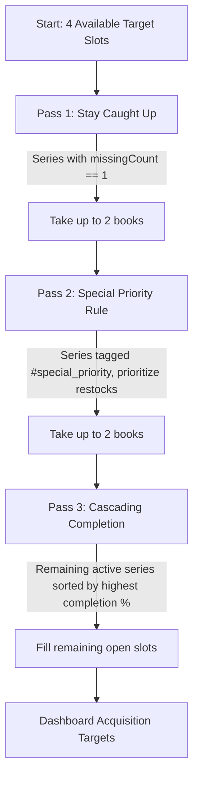

# Project Canelé 🍮

[](https://flutter.dev)
[](https://dart.dev)
[](LICENSE)
[](https://pub.dev/packages/hive)
[](#deterministic-quota-engine)

**Project Canelé** is a local-first, deterministic book collection manager and acquisition planner built with Flutter and Riverpod. Designed for collectors of light novels, manga, comics, and books, Canelé replaces opaque recommendation algorithms with an auditable, multi-pass priority waterfall and a mathematical quota cadence system.

---

## Table of Contents

- [Key Features](#key-features)
- [Design Philosophy & Aesthetic](#design-philosophy--aesthetic)
- [Tech Stack](#tech-stack)
- [Prerequisites](#prerequisites)
- [Getting Started](#getting-started)
- [Core Architecture & Systems](#core-architecture--systems)
  - [Directory Structure](#directory-structure)
  - [Deterministic Quota Engine](#deterministic-quota-engine)
  - [Multi-Pass Recommendation Waterfall (Rule Studio)](#multi-pass-recommendation-waterfall-rule-studio)
  - [Universal File Importer & Smart Parsing](#universal-file-importer--smart-parsing)
  - [Data Model & Hive Storage Architecture](#data-model--hive-storage-architecture)
  - [State Management with Riverpod](#state-management-with-riverpod)
- [Available Scripts & Tooling](#available-scripts--tooling)
- [Testing](#testing)
- [Data Portability & File Formats](#data-portability--file-formats)
- [Building for Release](#building-for-release)
- [Troubleshooting & FAQ](#troubleshooting--faq)

---

## Key Features

- 📐 **100% Deterministic & Transparent**: No machine learning, no black-box AI. All monthly targets and recommendations are derived from explicit arithmetic and user-configured evaluation passes.
- 🎯 **Multi-Pass Recommendation Waterfall**: Sequential 4-slot target queue that prioritizes books based on configurable criteria (*Stay Caught Up*, *Restocked Watchlists*, *Cascading Completion %*, and custom user passes).
- ⚖️ **Cadence & Quota Engine**:
  - Distinguishes between **Regular** and **Bonus** quota buckets.
  - Automatically handles **Gifts** without consuming budget quotas.
  - Excludes configured **No-Book Months** from timeline expectations.
  - Computes **Ahead-of-Schedule Auto-Skip Projections** with exact catch-up dates when surplus books are acquired.
- 📚 **Fractional & Special Volume Support**: Native handling of decimal volumes (e.g., *Vol. 11.5* side stories, special edition releases, unnumbered omnibus editions).
- 📦 **Universal File Importer**:
  - One-click import for **Goodreads CSV**, **StoryGraph CSV**, **Generic CSV**, and **Microsoft Excel (.xlsx)**.
  - Smart title normalization that extracts clean series titles and volume numbers while stripping binding noise (`(Light Novel)`, `(Paperback)`, `(Manga)`).
  - Interactive pre-commit review screen to inspect, toggle, and batch-import books.
- 💾 **Local-First & Fully Portable**:
  - All data is persisted on-device using lightweight NoSQL Hive boxes.
  - Complete JSON database backup and restoration directly via clipboard or `.json` files.
- 🍮 **Bespoke Canelé Palette**: Custom warm UI inspired by French canelé pastries (custard cream, caramelized amber, warm pastry crust, deep caramel), with full Light, Dark, and System Theme modes.

---

## Design Philosophy & Aesthetic

Project Canelé takes visual inspiration from the French *canelé de Bordeaux* pastry:
- **Custard Cream (`#FDFBF7`)**: Soft, warm background tint that eliminates harsh contrast.
- **Caramelized Amber (`#8C4A2F` / `#C86D46`)**: Rich accent and action tone reflecting the caramelized shell.
- **Warm Pastry Crust (`#EADBCE` / `#DCC8B6`)**: Subtle card fills and borders that delineate UI surfaces.
- **Deep Caramel (`#331E14` / `#251C17`)**: High-contrast typography and elevated surfaces in Dark Mode.

---

## Tech Stack

| Layer | Technology | Details |
| :--- | :--- | :--- |
| **Framework** | [Flutter](https://flutter.dev) | SDK 3.x+ (Dart SDK `^3.12.2`) |
| **State Management** | [Flutter Riverpod](https://pub.dev/packages/flutter_riverpod) | `v2.5.1` — Reactive, decoupled notifier providers |
| **Local Storage** | [Hive](https://pub.dev/packages/hive) & [Hive Flutter](https://pub.dev/packages/hive_flutter) | `v2.2.3` / `v1.1.0` — Fast key-value embedded NoSQL |
| **Typography** | [Google Fonts](https://pub.dev/packages/google_fonts) | `v6.2.1` — Plus Jakarta Sans |
| **Spreadsheet / CSV Parsing** | [csv](https://pub.dev/packages/csv) & [excel](https://pub.dev/packages/excel) | `csv: ^6.0.0`, `excel: ^4.0.6` |
| **File Handling & Sharing** | [file_picker](https://pub.dev/packages/file_picker), [share_plus](https://pub.dev/packages/share_plus) | System file dialogues & data export |
| **Unique Identifiers & Dates** | [uuid](https://pub.dev/packages/uuid), [intl](https://pub.dev/packages/intl) | RFC 4122 v4 UUIDs, localized formatters |

---

## Prerequisites

Before running the application, make sure you have the following installed on your machine:

- **Flutter SDK**: `3.22.0` or higher (`flutter --version`)
- **Dart SDK**: `3.4.0` or higher (bundled with Flutter)
- **Target Platform Tools**:
  - **Android**: Android Studio with Android SDK & Platform Tools (API Level 21+)
  - **iOS / macOS**: Xcode 15+ and CocoaPods (for Apple platforms)
  - **Desktop (Windows/Linux)**: Visual Studio C++ build tools (Windows) or `clang`/`cmake` (Linux)

---

## Getting Started

### 1. Clone the Repository

```bash
git clone https://github.com/YTFL/Project-Canele.git
cd Project-Canele
```

### 2. Install Dependencies

Fetch all Flutter packages specified in `pubspec.yaml`:

```bash
flutter pub get
```

### 3. Verify Flutter Environment

Ensure that your target device or emulator is detected:

```bash
flutter doctor
flutter devices
```

### 4. Run the Application

Launch the app on your connected device, emulator, or desktop target:

```bash
# Run on default connected device
flutter run

# Run specifically on Android
flutter run -d android

# Run on Chrome (Web)
flutter run -d chrome

# Run on Windows Desktop
flutter run -d windows
```

---

## Core Architecture & Systems

### Directory Structure

```
Project-Canele/
├── assets/
│   └── icons/                 # App launcher icons & graphical assets
├── lib/
│   ├── main.dart              # Application entry point & Hive initialization
│   ├── core/
│   │   ├── constants/         # AppColors and global constants
│   │   ├── database/          # HiveBoxes setup, JsonBackupService
│   │   ├── theme/             # AppTheme (Light & Dark pastry styles)
│   │   └── utils/             # DateFormatter, UuidGenerator
│   ├── models/                # Immutable domain models & serializers
│   │   ├── import_item.dart
│   │   ├── purchase_transaction.dart
│   │   ├── recommendation_pass.dart
│   │   ├── rule_config.dart
│   │   ├── series.dart
│   │   └── volume.dart
│   ├── providers/             # Riverpod StateNotifiers & computed providers
│   │   ├── database_provider.dart
│   │   ├── quota_provider.dart
│   │   ├── recommendation_provider.dart
│   │   ├── series_provider.dart
│   │   └── theme_provider.dart
│   ├── repositories/          # CRUD persistence layer over Hive boxes
│   │   ├── pass_repository.dart
│   │   ├── rule_config_repository.dart
│   │   ├── series_repository.dart
│   │   ├── transaction_repository.dart
│   │   └── volume_repository.dart
│   ├── services/              # Pure business logic & calculation engines
│   │   ├── quota_engine.dart
│   │   ├── rule_evaluator.dart
│   │   └── universal_importer.dart
│   └── ui/
│       ├── screens/           # Primary application view screens
│       │   ├── collection_screen.dart
│       │   ├── dashboard_screen.dart
│       │   ├── import_review_screen.dart
│       │   ├── main_shell_screen.dart
│       │   ├── onboarding_screen.dart
│       │   ├── rule_studio_screen.dart
│       │   ├── series_detail_screen.dart
│       │   └── settings_screen.dart
│       └── widgets/           # Reusable UI components
│           ├── canele_card.dart
│           ├── canele_month_year_picker.dart
│           ├── canele_progress_bar.dart
│           ├── log_transaction_sheet.dart
│           ├── quota_status_card.dart
│           ├── recommendation_slot_card.dart
│           └── volume_checklist_tile.dart
├── test/
│   ├── importer_test.dart       # Tests for Goodreads/StoryGraph/CSV/Excel parsers
│   ├── quota_engine_test.dart   # Tests for arithmetic, quota & auto-skip projection
│   ├── rule_evaluator_test.dart # Tests for waterfall passes & slot limits
│   └── widget_test.dart         # Widget & UI validation tests
├── analysis_options.yaml      # Strict static analysis rules
└── pubspec.yaml               # Dependencies and metadata
```

---

### Deterministic Quota Engine

The **Quota Engine** (`lib/services/quota_engine.dart`) eliminates ambiguity in tracking purchasing budgets over time through exact arithmetic formulas:

$$\text{Active Months} = \{m \in [\text{StartDate}, \text{CurrentDate}] \mid m \notin \text{NoBookMonths}\}$$

$$\text{Regular Expected} = |\text{Active Months}| \times \text{DefaultPerMonth}$$

$$\text{Bonus Expected} = \sum_{m \in \text{Active Months}} \mathbb{I}(m \in \text{BonusMonths}) + \text{CustomLedgerBonuses} + \text{ManualBonuses}$$

$$\text{Regular Remaining} = \text{Regular Expected} - \text{Regular Bought}$$

$$\text{Bonus Remaining} = \text{Bonus Expected} - \text{Bonus Bought}$$

#### Auto-Skip Ahead-of-Schedule Resolution
When a user buys more books than scheduled ($\text{Regular Remaining} < 0$), the engine simulates subsequent active calendar months to compute:
1. **Surplus Credit Count**: Exact count of advance volumes owned.
2. **Projected Catch-Up Month**: The exact future month (e.g., *"November 2026"*) when cumulative expected quota will catch up to actual purchases, informing the user when their next regular book budget opens.

---

### Multi-Pass Recommendation Waterfall (Rule Studio)

The **Rule Evaluator** (`lib/services/rule_evaluator.dart`) processes all active series through an ordered, configurable pipeline of recommendation passes until **4 recommendation slots** are filled:



#### Pass Capabilities & Criteria:
- **Status Filter**: `active`, `wishlist`, or `any`.
- **Missing Volume Conditions**: `equals_1` (1 volume away from caught up), `less_equal_2` ($\le 2$ volumes), or `any`.
- **Restock Priority**: Prioritizes out-of-stock items that returned to stock (`isRestockedWatchlist == true`).
- **Sorting Modes**: Oldest Release Date (`releaseDateAsc`), Newest Release Date (`releaseDateDesc`), Completion Rate (`seriesCompletionDesc`), Lowest Volume Number (`volumeNumberAsc`).
- **Take Limits**: Configurable max items per pass to prevent any single rule from monopolizing the monthly queue.

---

### Universal File Importer & Smart Parsing

The **Universal Importer** (`lib/services/universal_importer.dart`) cleans messy metadata from external catalogs using multi-stage regular expressions:

1. **Format Tag Stripping**: Removes trailing binding strings such as `(Light Novel)`, `(Manga)`, `(Paperback)`, `(Hardcover)`, `(Kindle Edition)`.
2. **Catalog Suffix Stripping**: Removes Goodreads series markers like `(Frieren, #10)`.
3. **Volume Extraction**: Accurately parses integer and decimal volume numbers across varied syntaxes (`Vol. 11.5`, `- Volume 10`, `Book 3`, `#4`, `v2.5`, `Ch. 12`).
4. **Header Detection**: Automatically detects column mappings for Goodreads exports, StoryGraph exports, and generic custom spreadsheets.

---

### Data Model & Hive Storage Architecture

All models are serialized to JSON maps and stored across isolated Hive boxes:

| Hive Box Name | Type | Purpose |
| :--- | :--- | :--- |
| `seriesBox` | `Map<String, dynamic>` | Stores `Series` records (title, type, status, tags, custom metadata). |
| `volumesBox` | `Map<String, dynamic>` | Stores `Volume` records (volume number, release date, availability, owned state). |
| `transactionsBox` | `Map<String, dynamic>` | Stores `PurchaseTransaction` logs (purchase date, quota bucket, price, notes). |
| `ruleConfigBox` | `Map<String, dynamic>` | Stores global `RuleConfig` (start date, monthly cadence, bonus lists, skipped months). |
| `passesBox` | `Map<String, dynamic>` | Stores ordered `RecommendationPass` pipeline definitions. |

---

### State Management with Riverpod

Canelé uses Flutter Riverpod 2.x for declarative state management:

```
Hive Storage
    │
    ▼
Repositories (SeriesRepo, VolumeRepo, TransactionRepo, RuleConfigRepo, PassRepo)
    │
    ▼
StateNotifiers (seriesNotifierProvider, volumesNotifierProvider, etc.)
    │
    ├─► quotaProvider (Computes QuotaSummary from transactions & ruleConfig)
    │
    ├─► recommendationSlotsProvider (Runs RuleEvaluator over series, volumes & passes)
    │
    └─► dashboardMetricsProvider (Aggregates total owned, outlay, series counts)
         │
         ▼
UI Screens & Widgets (Dashboard, Collection, Rule Studio, Series Detail)
```

---

## Available Scripts & Tooling

| Task | Command | Description |
| :--- | :--- | :--- |
| **Run App** | `flutter run` | Starts the app in debug mode on connected device |
| **Run Tests** | `flutter test` | Executes all unit and widget tests |
| **Run Specific Test** | `flutter test test/quota_engine_test.dart` | Runs specific test suite |
| **Analyze Code** | `flutter analyze` | Runs Dart static analyzer according to `analysis_options.yaml` |
| **Update Dependencies** | `flutter pub upgrade` | Upgrades dependencies within semver constraints |
| **Generate Icons** | `dart run flutter_launcher_icons` | Generates launcher icons from `assets/icons/icon.png` |
| **Clean Build Cache** | `flutter clean` | Wipes build artifacts and temporary files |

---

## Testing

Project Canelé includes comprehensive automated test coverage for core business logic, parsing engines, arithmetic, and widget interactions:

```bash
# Run the complete test suite
flutter test
```

### Test Suites Overview:
- `test/quota_engine_test.dart`: Validates active month calculations, bonus ledgers, no-book exclusion, quota remaining arithmetic, and forward auto-skip simulation.
- `test/rule_evaluator_test.dart`: Validates multi-pass execution, slot limits, restock prioritization, decimal volume sorting, and candidate deduplication.
- `test/importer_test.dart`: Validates regex parsing of edge-case title strings, decimal volume formats, Goodreads CSVs, StoryGraph CSVs, and custom CSV layouts.
- `test/widget_test.dart`: Verifies UI rendering of balance metrics, Onboarding Wizard steps, and Quota cards.

---

## Data Portability & File Formats

### JSON Full Backup Schema
You can export or restore the entire database in a single JSON structure from **Settings > Data Portability**:

```json
{
  "version": "1.0.0",
  "exportedAt": "2026-08-26T12:00:00.000Z",
  "series": [
    {
      "id": "series_86",
      "title": "86 - Eighty-Six",
      "type": "lightNovel",
      "status": "active",
      "tags": ["special_priority", "restock_watch"],
      "customMetadata": {}
    }
  ],
  "volumes": [
    {
      "id": "vol_86_11_5",
      "seriesId": "series_86",
      "volumeNumber": 11.5,
      "releaseDate": "2024-02-20T00:00:00.000Z",
      "isOwned": true,
      "isGift": true,
      "availability": "available",
      "isRestockedWatchlist": false
    }
  ],
  "transactions": [
    {
      "id": "tx_01",
      "volumeId": "vol_86_11_5",
      "purchaseDate": "2024-02-25T00:00:00.000Z",
      "quotaBucket": "gift",
      "price": 0.0,
      "notes": "Birthday gift"
    }
  ],
  "ruleConfig": {
    "id": "global_config",
    "timelineStartDate": "2024-01-01T00:00:00.000Z",
    "defaultRegularPerMonth": 1,
    "bonusMonths": [5, 12],
    "noBookMonths": ["2024-06"],
    "manualBonusCount": 0,
    "customBonusLedger": {},
    "isOnboardingCompleted": true
  },
  "passes": [
    {
      "id": "pass_stay_caught_up",
      "name": "Stay Caught Up",
      "description": "Select active series missing exactly 1 released volume",
      "order": 0,
      "isEnabled": true,
      "takeLimit": 2,
      "filterCriteria": {
        "status": "active",
        "missingVolumeCount": "equals_1",
        "availability": "available"
      },
      "sortCriteria": "releaseDateAsc"
    }
  ]
}
```

---

## Building for Release

### Android APK / App Bundle

```bash
# Build universal Release APK
flutter build apk --release

# Build Google Play App Bundle (.aab)
flutter build appbundle --release
```

Output binaries will be located in `build/app/outputs/flutter-apk/` and `build/app/outputs/bundle/release/`.

### iOS IPA

```bash
flutter build ipa --release
```

### Windows Desktop

```bash
flutter build windows --release
```

Output directory: `build/windows/x64/runner/Release/`.

### Web Build

```bash
flutter build web --release
```

Output directory: `build/web/`.

---

## Troubleshooting & FAQ

### 1. Hive boxes fail to open or throw BoxAlreadyOpenException
- **Cause**: Re-initializing Hive during hot restart without proper singleton checks.
- **Fix**: Hive initialization in `main.dart` is protected by `HiveBoxes.init()`. If running tests, use memory directories or tear down Hive between suites via `Hive.close()`.

### 2. CSV/Excel import not detecting volume numbers
- **Cause**: Unconventional column headers in custom spreadsheets.
- **Fix**: Ensure your file contains headers such as `Title` or `Series`, and `Volume` or `Vol`. Alternatively, format the title column to include the volume (e.g., `"Frieren, Vol. 10"`), and Canelé's smart regex will automatically extract it.

### 3. Quota balance shows "Ahead of Schedule" unexpectedly
- **Cause**: You logged more `regular` transactions than the calculated active months from your `timelineStartDate`.
- **Fix**: If these were bought as holiday specials, gifts, or bonuses, edit the transaction in the series detail screen and reassign the bucket to **Bonus** or **Gift**.

---

## License

This project is licensed under the MIT License. See [LICENSE](LICENSE) for details.

